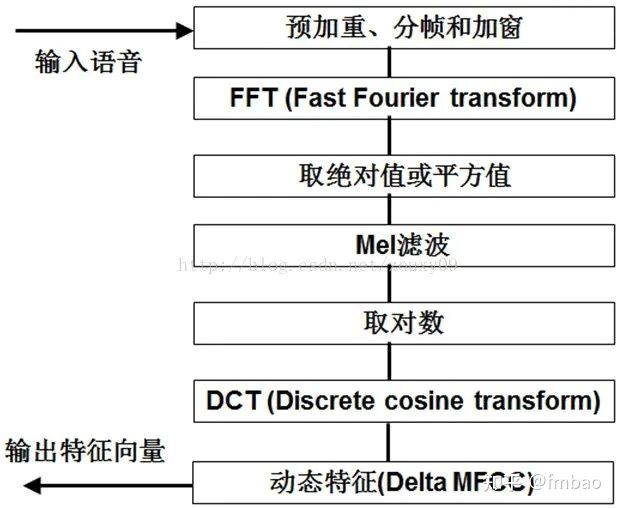

<!--
 * @Author: Baochenchen 1689940525@qq.com
 * @Date: 2022-07-09 15:23:56
 * @LastEditors: Baochenchen 1689940525@qq.com
 * @LastEditTime: 2022-07-09 15:26:37
 * @FilePath: /interview_ns/Volumes/YAYA/Document/知乎专栏/interview_kws/README.md
 * @Description: 这是默认设置,请设置`customMade`, 打开koroFileHeader查看配置 进行设置: https://github.com/OBKoro1/koro1FileHeader/wiki/%E9%85%8D%E7%BD%AE
-->
# interview_kws
这是一些语音唤醒的面经的总结，欢迎大家多多push新的的内容

1. 【问】有关声学模型，语言模型之间的差别:
【答】声学模型其实就是可以识别单个音素的模型（音素a的模型可以判定一小段语音是否是a）；语言模型表示一个个词串（如何结合了词典，就可以成为一个个音素串）它们在语料库中出现的概率大小（比如，不合语法的词串（句子）概率接近0，很合乎语法的词串概率大）；解码器就是基于Viterbi算法在HMM模型上搜索生成给定观测值序列（待识别语音的声学特征）概率最大的HMM状态序列，再由HMM状态序列获取对应的词序列，得到结果结果。如果你只做单个音素识别，（语音很短，内容只是音素），那么只用声学模型就可以做到，不用语言模型。做法就是在每个音素的声学模型上使用解码器做解码（简单的Viterbi算法即可）。但是，通常是要识别一个比较长的语音，这段语音中包含了很多词。这就需要把所有可能的词串，结合词典展开为音素串，再跟音素的声学模型结合，可以得到解码图（实际上可以看成很多很多HMM模型连接而成），然后在这个解码图上实施Viterbi算法，得到最佳序列，进而得到识别结果。

2. 【问】CTC的基本原理:
【答】https://blog.ailemon.net/2020/10/26/asr-ctc-decoder-theory/

3. 【问】加混响的几种方法:
【答】在这篇文章讲述了几种进行音频增强的方法：https://www.cnblogs.com/LXP-Never/p/13404523.html#blogTitle7

4. 【问】音频前处理的几个步骤:
【答】语音信号的前处理步骤：
预加重：
为了消除发声过程中，声带和嘴唇造成的效应，来补偿语音信号受到发音系统所压抑的高频部分，并且凸显高频的共振峰。
分帧(分帧讲的比较好的：https://www.zhihu.com/question/52093104)
因为傅里叶变换要求输入信号是平稳的，但是语音信号在宏观上是不平稳的，在微观上是平稳的，具有短时平稳性（10-30ms可以认为语音信号近似不变），这样就可以把语音信号分为一个个短的信号段进行处理，每个短段称之为一帧**（chunk）**
如果后续操作需要加窗，那么在分帧的时候，就不要背靠背地进行截取，而是互相重叠一部分。相邻两帧的起始位置的时间差称之为帧移**（stide）**
加窗
加窗操作也就是音频数据和窗函数相乘，加窗之后是为了进行傅里叶展开。
这个目的：
为了使得全局更加连续，避免出现吉布斯效应
加窗的时候，没有周期性语音信号呈现出周期函数的部分特征
加窗的代价是一帧信号的两端部分被部分削弱了，所以帧与帧之间需要进行重叠

5. 【问】MFCC Fbank 对比:
【答】
Fbank（也叫做Filter Bank）和MFCC的计算步骤基本一致，只是没有做IDFT而已。

> 计算量：MFCC是在Fbank的基础上进行的，所以MFCC的计算量更大
> 特征区分度：Fbank的特征相关性比较高，这是因为相邻滤波器组是有重叠的，MFCC具有更好的判别度，这也是很多语音识别的论文中使用的MFCC的原因
> 使用对角协方差矩阵的GMM由于忽略了不同特征维度的相关性，MFCC更适合用来做特征。
> 在DNN做声学模型的时候，一般采用的是Filter Bank，不用MFCC，这是因为Fbank的信息更多（MFCC是由mel fbank有损变换得到的）。但是，但是GMM做声学模型的时候，用MFCC比较多，这是通常GMM假设是对角协方差矩阵，MFCC中的倒谱因子更加符合这个假设，在Filter bank中线性谱里面的冗余信息太多了，维度也很高，所以一般不适用

6. 【问】ASR的流式处理问题
   【答】
   主要参考的是：
   https://zhuanlan.zhihu.com/p/377983386
   流式语音识别，指的是在处理音频流的过程中，支持实时返回识别结果的一类ASR模型。和之前相对的是非流式模型，他必须在处理完整语句之后才能返回结果。流式的ASR可以更好的应用实时获取识别结果的场景，比如说直播实时字幕，会议实时记录，语音输入，语音唤醒等场景。
   流式ASR的问题形式化
   我当时也是参考的：https://zhuanlan.zhihu.com/p/377983386
   流式ASR是一类比较具体的ASR问题，和作者之前的语音识别算法不完全归纳乐死，可以这样定义流式ASR：持续接收音频流进行识别，并且根据已经接收的一部分 $ O=o_{1:t}$ ，获取对应的后验概率最大的token序列:
   $W^*=w_{1:n}$
   也就是：
    $W^*=argmaxP(W|O)=argmaxP(w_{1:n}|o_{1:t})$
   流式和非流式的区别就是在于 $O$ 是取的整句上下文$ o_{1:T}$ ，还是上文 $o_{1:t}$ ,其中$ t$ 是已经接收音频特征流的当前帧索引，在实现中，允许模型有一定的延迟，此时虽然已经接收了$ t$ 帧的输入，但是实际解码到的第$ t-r$ 帧，$ r$ 是有限的下文长度。或者对上文长度也有一定的限制，也就是在对$  t$ 帧后验概率建模的时候，只要考虑指定长度的上下文内容：
   $ p(w_t|O)=p(w_t|o_{t-lc:t+rc}) $
   其中$ lc$ 和$ rc$ 就是上下文的一个长度。
   另外流式的ASR也是有实时率的要求，一般来说实时率 (RealTime Factor,RTF)定义为模型处理时间和音频长度的比值，比如说处理2s的音频耗时0.6s 那么就是说 RTF=0.6s/2s=0.3 由于模型是对历史输入进行建模，历史输入会随着时间不断增长，这就有可能导致模型计算量逐渐增加，RTF不断增长，当RTF>1.0的时候，说明模型已经来不及处理缓存的音频了，这就是说明无法实时处理的定量标准。
7. 【问】语音唤醒中常用的几种loss函数
